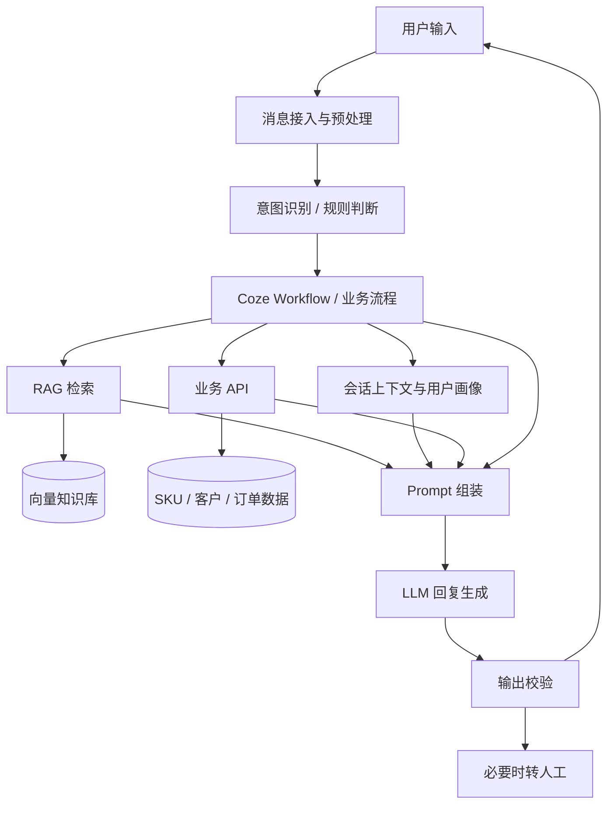

# 销售专家 Agent 产品需求文档

## 目录

- [1. 项目背景](#1-项目背景)
- [2. 产品定位](#2-产品定位)
- [3. 竞品分析与产品机会](#3-竞品分析与产品机会)
- [4. 目标用户与核心场景](#4-目标用户与核心场景)
- [5. 用户旅程](#5-用户旅程)
- [6. 产品与 AI 能力架构](#6-产品与-ai-能力架构)
- [7. 核心功能需求](#7-核心功能需求)
- [8. Prompt 与知识库设计](#8-prompt-与知识库设计)
- [9. 数据接入与用户画像](#9-数据接入与用户画像)
- [10. 异常处理与兜底机制](#10-异常处理与兜底机制)
- [11. 测试与验收标准](#11-测试与验收标准)

---

## 1. 项目背景

### 1.1 行业背景

生成式 AI 在企业服务、电商客服与智能销售场景中的应用逐步成熟，传统基于 FAQ、关键词匹配、规则引擎和固定 SOP 的智能客服，在标准问答、物流查询、退款售后等高频场景中已具备较高自动化水平，但在开放式需求理解、多轮上下文保持、个性化商品推荐和销售引导等场景中，仍存在回复模板化、泛化能力不足和用户体验割裂等问题。

海外独立站商家通常拥有相对独立的商品、客户、订单及品牌知识体系，具备较强的数据自主权和服务定制需求。现有通用客服方案难以直接适配不同商家的 SKU、商品规则、售后政策和品牌话术，需要构建具备商家级知识接入、业务流程配置和用户画像能力的智能客服方案。

### 1.2 业务问题

当前业务主要存在以下问题：

1. **标准客服能力与复杂需求之间存在能力缺口**  
   对明确 FAQ 问题具备较高响应效率，但对自然语言变体、模糊表达及连续追问的理解能力有限。

2. **不同商家知识体系差异较大**  
   不同独立站的商品 SKU、价格信息、品牌规范、售后规则和 FAQ 相互独立，通用知识体系无法直接复用。

3. **客服与销售转化链路割裂**  
   传统客服以被动应答为主，对用户预算、购买对象、使用场景和商品偏好的进一步挖掘不足。

4. **用户信息沉淀能力不足**  
   用户在咨询过程中产生的预算、偏好、购买场景及关注商品等信息未形成持续可复用的结构化画像。

5. **企业私有数据与 AI 能力缺少有效连接**  
   商品知识、SKU 数据、订单和客户数据分散在不同业务系统中，需要通过知识库和 API 建立统一调用链路。

### 1.3 建设目标

建设一套面向海外独立站商家的 AI 智能销售客服能力，实现：

- 商家私有商品知识与 FAQ 的统一接入；
- 多轮自然语言理解与上下文保持；
- 基于用户需求和商品数据的个性化推荐；
- 关键客服与销售流程的 Workflow 编排；
- 用户偏好、预算和关注商品等信息的持续沉淀；
- 与 SKU、订单、客户等业务系统的数据连接；
- 对低置信度、知识缺失和异常场景进行稳定兜底。

---

## 2. 产品定位

### 2.1 产品定义

销售专家 Agent 是一套面向海外独立站商家的 AI 智能客服与销售辅助产品。

产品以大语言模型作为自然语言理解与生成核心，通过 RAG 接入商家私有知识，通过 Coze Workflow 和业务规则控制关键服务流程，并结合用户画像与业务数据完成商品咨询、需求识别、商品推荐、订单查询及基础销售辅助。

### 2.2 核心价值

#### 商家侧

- 降低重复性客服咨询的人力成本；
- 提升商品知识和服务规则的统一性；
- 支持不同商家的知识、Prompt、Workflow 和品牌语气独立配置；
- 将独立站已有商品和客户数据转化为可被 AI 调用的业务能力。

#### 用户侧

- 提升自然语言交互体验；
- 减少重复描述需求的成本；
- 获得基于预算、偏好和使用场景的商品推荐；
- 在商品咨询、订单与售后场景中获得更连续的服务体验。

### 2.3 产品原则

1. **知识有据可查**：商品参数、价格、售后规则等事实信息必须以知识库或业务数据为依据。
2. **流程可控**：关键业务节点采用 Workflow、规则或 SOP 控制，不完全依赖模型自主判断。
3. **数据实时性分层处理**：稳定知识通过 RAG 管理，动态业务数据通过 API 获取。
4. **用户信息最小化推断**：仅沉淀用户明确表达或高置信度提取的信息，不将模型推测直接写入用户画像。
5. **异常可降级**：在 RAG、API 或模型能力异常时，可回退至 FAQ、规则流程或人工客服。

---

## 3. 竞品分析与产品机会

### 3.1 竞品范围

竞品分析重点覆盖淘宝、京东等国内成熟电商平台智能客服方案，围绕客服自动化能力、商品问答、多轮对话、商品推荐、商家配置和销售辅助等维度进行拆解。

### 3.2 能力对比

| 分析维度 | 传统电商智能客服常见能力 | 本产品设计方向 |
|---|---|---|
| 标准问答 | FAQ、关键词匹配、意图识别、规则/SOP | 在保留确定性流程基础上引入 LLM 自然语言理解 |
| 多轮对话 | 对标准流程支持较好，开放式上下文能力有限 | 支持上下文指代和连续追问理解 |
| 商品知识 | 依赖平台内部商品与知识体系 | 接入独立站商家私有 SKU 与知识库 |
| 商品推荐 | 平台统一推荐能力 | 结合商家 SKU、用户预算和偏好进行定制推荐 |
| 用户信息 | 依赖平台内部用户体系 | 结合独立站用户数据与会话画像 |
| 商家配置 | 受平台统一体系约束 | 支持知识库、Prompt、Workflow 和品牌风格配置 |
| 服务目标 | 以问题解决和客服效率为主 | 覆盖客服效率与基础销售辅助 |

### 3.3 产品机会

海外独立站具备较高的数据自主权和服务定制空间，可通过企业私有知识和业务数据增强大语言模型能力，形成统一的 AI 客服底座，并针对不同商家加载独立的：

- SKU 商品数据；
- FAQ 与售后知识；
- 品牌话术；
- Prompt；
- Workflow；
- 用户画像数据。

基于上述能力，可实现“通用 AI 能力底座 + 商家级数据与配置”的产品模式。

---

## 4. 目标用户与核心场景

### 4.1 目标用户

#### C 端用户

进入海外独立站进行商品浏览、咨询、下单或售后服务的消费者。

#### 商家用户

负责商品管理、客服配置、品牌规则及客户运营的独立站商家。

### 4.2 核心场景

1. 商品参数咨询；
2. 商品推荐；
3. 模糊需求澄清；
4. 多轮商品对比；
5. 订单及物流查询；
6. 售后 FAQ；
7. 用户偏好沉淀；
8. 人工客服转接。

---

## 5. 用户旅程

### 5.1 用户咨询流程

1. 用户进入独立站并打开客服窗口；
2. 系统识别用户当前意图；
3. 根据用户问题进入对应 Workflow；
4. 稳定知识类问题进入 RAG 检索；
5. 动态业务数据进入 API 查询；
6. 系统结合会话上下文、用户画像和业务数据组装 Prompt；
7. LLM 生成最终回复；
8. 对明确的用户偏好、预算和关注商品进行画像更新；
9. 无法可靠处理时进入澄清或人工转接流程。

### 5.2 典型场景：模糊商品需求

用户输入：

> “想买一款 500 元以内、适合跑步的耳机。”

处理流程：

1. 识别意图为商品推荐；
2. 提取预算 `<500`、场景 `运动/跑步`；
3. 判断关键需求是否完整；
4. 从商品知识与 SKU 数据中召回候选商品；
5. 根据用户需求筛选候选 SKU；
6. 返回商品及推荐理由；
7. 将预算和使用场景写入当前用户画像。

---

## 6. 产品与 AI 能力架构

### 6.1 核心架构



### 6.2 模块职责

| 模块 | 职责 |
|---|---|
| 意图识别 | 判断商品咨询、商品推荐、物流、售后、人工客服等主要诉求 |
| Coze Workflow | 控制知识检索、数据查询、回复生成和兜底路径 |
| RAG 知识库 | 提供商品、FAQ、品牌、售后等企业私有知识 |
| 用户画像 | 保存预算、偏好、购买场景、关注商品等结构化信息 |
| 业务 API | 获取 SKU、库存、订单、客户等结构化业务数据 |
| Prompt | 定义角色、业务规则、知识约束和输出规范 |
| LLM | 负责自然语言理解、信息提取和回复生成 |
| 人工转接 | 处理无法可靠完成或明确要求人工介入的场景 |

---

## 7. 核心功能需求

### F-01 商家私有知识库与 RAG

#### 7.1.1 知识源范围

知识库支持接入：

- SKU / 商品详情；
- 商品参数；
- 商品使用说明；
- FAQ；
- 物流规则；
- 售后政策；
- 品牌资料；
- 客服话术。

#### 7.1.2 RAG 处理链路

**Data → Chunking → Embedding → Vector Retrieval → Rerank → Context → Prompt → LLM**

1. **Data**：保证原始知识准确、完整、有效；
2. **Chunking**：按照语义完整性进行知识切分；
3. **Embedding**：将知识片段转换为向量表示；
4. **Vector Retrieval**：根据 Query 召回相关知识片段；
5. **Rerank**：对候选知识进行二次排序；
6. **Context**：整理最终注入模型的有效知识；
7. **Prompt**：添加角色、规则和知识约束；
8. **LLM**：生成最终自然语言回复。

#### 7.1.3 RAG 约束

- 未召回可靠知识时，不允许生成未经验证的商品参数；
- 商品知识冲突时，优先使用业务系统确认的数据；
- 价格、库存、订单、物流等高时效数据不得仅依赖静态知识库。

---

### F-02 用户画像与会话上下文

#### 7.2.1 会话上下文

系统需保留当前会话内必要上下文，用于理解：

- “这个”；
- “刚才那个”；
- “第二款”；
- “便宜一点的”；
- “还有其他颜色吗”等连续表达。

#### 7.2.2 用户画像字段

支持沉淀：

- 预算；
- 商品类别偏好；
- 颜色偏好；
- 风格偏好；
- 材质偏好；
- 购买对象；
- 使用场景；
- 关注 SKU；
- 明确表达的核心顾虑。

#### 7.2.3 更新规则

- 用户明确表达的信息可直接更新；
- 新旧信息冲突时，以最新明确表达为准；
- 模型推测信息不得直接作为确定字段写入。

---

### F-03 意图识别与业务路由

| 用户意图 | 处理逻辑 |
|---|---|
| 商品参数咨询 | RAG 商品知识检索 |
| 商品推荐 | 进入需求补充与 SKU 匹配 |
| 价格 / 库存 | 查询商品数据或业务 API |
| 物流 / 订单 | 调用订单 / 物流接口 |
| 退款 / 售后 | FAQ / SOP / 售后规则 |
| 人工客服 | 进入人工转接 |
| 无法识别 | 发起澄清 |

关键业务流程采用 LLM 分类、规则判断和 Workflow 条件共同完成。

---

### F-04 多轮需求补充与商品推荐

当用户需求不完整时，系统按照实际业务需要补充：

1. 商品类别；
2. 使用场景或购买对象；
3. 预算；
4. 关键偏好。

当推荐条件满足后，从商家 SKU 范围内返回匹配商品，并说明推荐依据。

---

### F-05 API 与业务数据接入

### 7.5.1 数据分类

#### 稳定 / 低频变更数据

例如：

- 商品介绍；
- FAQ；
- 售后政策；
- 品牌说明。

采用数据同步 + RAG 方式接入。

#### 实时 / 高频变更数据

例如：

- 库存；
- 订单；
- 物流；
- 部分价格信息。

采用 API 查询或业务系统实时同步。

### 7.5.2 订单查询示例

用户：

> “我的订单发货了吗？”

系统流程：

1. 识别订单 / 物流意图；
2. 获取订单标识；
3. 调用订单或物流 API；
4. 返回结构化业务结果；
5. 由 LLM 转换为自然语言回复。

---

### F-06 Prompt 与商家配置

每个商家可独立配置：

- 客服名称；
- 角色；
- 品牌语气；
- 服务规则；
- 销售引导规则；
- 禁止回答范围；
- 知识库；
- Workflow。

通过配置化方式实现商家差异化服务。

---

### F-07 标准客服 SOP 与人工转接

对退款、投诉、订单异常等确定性较高或风险较高的业务场景，采用：

**Intent Recognition + Rule / SOP + FAQ + Human Handoff**

LLM 主要用于自然语言理解和回复生成，不替代关键业务规则。

---

## 8. Prompt 与知识库设计

### 8.1 核心 Prompt 结构

```markdown
# Role
当前商家的智能客服与商品咨询助手。

# Goal
1. 准确理解用户问题；
2. 优先依据商家知识回答；
3. 在需求不完整时发起必要澄清；
4. 在符合业务规则时推荐商家现有商品。

# Context
- 用户问题：[User_Query]
- 会话上下文：[Conversation_Context]
- 用户画像：[User_Profile]
- RAG 结果：[Retrieved_Knowledge]
- 业务数据：[Business_Data]

# Rules
1. 商品参数、价格及售后规则以知识库或业务接口结果为准；
2. 无可靠依据时不得编造；
3. 回复需简洁、自然；
4. 退款、投诉等场景遵循 SOP；
5. 用户明确要求人工客服时进入人工转接。
```

### 8.2 RAG 效果问题定位

当 RAG 输出效果不符合预期时，按照以下链路逐层排查：

**Data → Chunking → Embedding → Retrieval → Rerank → Context → Prompt → LLM**

| 问题表现 | 优先排查 |
|---|---|
| 正确知识未召回 | Data / Chunking / Embedding / Retrieval |
| 正确知识已召回但排名靠后 | Rerank |
| 正确知识已进入 Context，但回答错误 | Context / Prompt / LLM |
| 库存、订单等实时信息错误 | API / 数据同步 |

---

## 9. 数据接入与用户画像

### 9.1 数据来源

根据商家实际授权与接口能力，系统可接入：

- SKU / 商品数据；
- 客户基础信息；
- 历史订单；
- FAQ；
- 售后知识；
- 品牌与营销资料。

### 9.2 数据闭环

```text
商家业务数据
    ↓
AI 客服提供咨询与推荐
    ↓
产生用户交互数据
    ↓
提取预算 / 偏好 / 场景 / 关注商品
    ↓
更新用户画像
    ↓
支持后续商品咨询与个性化推荐
```

---

## 10. 异常处理与兜底机制

### 10.1 异常场景

| 异常类型 | 处理方案 |
|---|---|
| 意图无法判断 | 请求用户补充信息或选择问题类型 |
| RAG 无有效召回 | 不生成无依据内容，提示进一步查询或转人工 |
| API 请求失败 | 提示稍后重试或转人工 |
| 商品知识冲突 | 以业务系统或确认后的知识源为准 |
| 模型输出异常 | 重新生成或进入规则兜底 |
| 连续无法解决 | 转人工客服 |

### 10.2 降级方案

当 LLM 或知识检索不可用时，系统回退至传统客服流程：

1. 关键词 / 意图匹配；
2. FAQ 标准答案；
3. Rule / SOP；
4. 人工客服。

---

## 11. 测试与验收标准

### 11.1 功能测试

- 知识库数据可正常导入；
- RAG 可正常召回知识；
- Workflow 路由符合业务规则；
- API 可正常返回业务数据；
- 用户画像字段可正常更新；
- 人工转接流程可用。

### 11.2 AI 效果测试

重点验证：

- 意图理解准确性；
- RAG 知识召回准确性；
- 商品事实回答准确性；
- 多轮上下文保持能力；
- 商品推荐相关性；
- 用户画像使用正确性；
- 知识缺失时的幻觉控制；
- Prompt 风格与商家配置一致性。

### 11.3 核心测试 Case

#### Case 1：商品知识准确性

**输入**

> “这款耳机支持防水吗？”

**验收要求**

- 召回对应 SKU 商品知识；
- 回复与知识库一致；
- 不引用其他商品参数。

#### Case 2：多轮上下文

**输入**

1. “这两款有什么区别？”
2. “第二个呢？”
3. “它适合跑步吗？”

**验收要求**

- 后续指代识别正确；
- 当前 SKU 上下文保持一致。

#### Case 3：模糊商品推荐

**输入**

> “想买个 500 元以内的礼物。”

**验收要求**

- 信息不足时补充关键需求；
- 推荐结果符合预算；
- 推荐商品必须来自当前商家 SKU。

#### Case 4：知识缺失

**输入**

用户询问知识库不存在的商品参数。

**验收要求**

- 不生成未经验证的信息；
- 提示暂未查询到；
- 支持进一步澄清或人工确认。

#### Case 5：用户画像

**前置条件**

用户已明确表示预算为 500 元以内。

**操作**

用户后续再次请求商品推荐。

**验收要求**

- 推荐逻辑继续使用已确认预算；
- 不无故推荐明显超预算商品。
