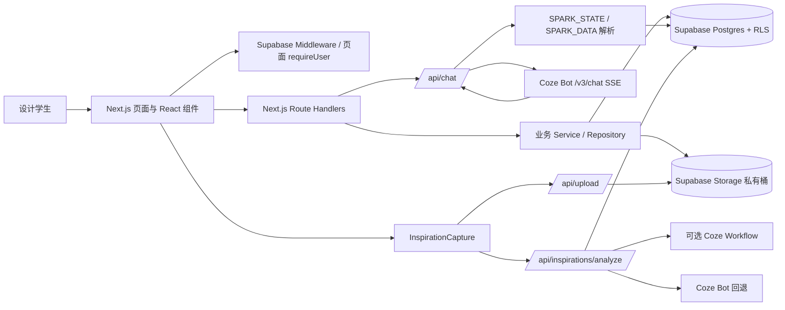
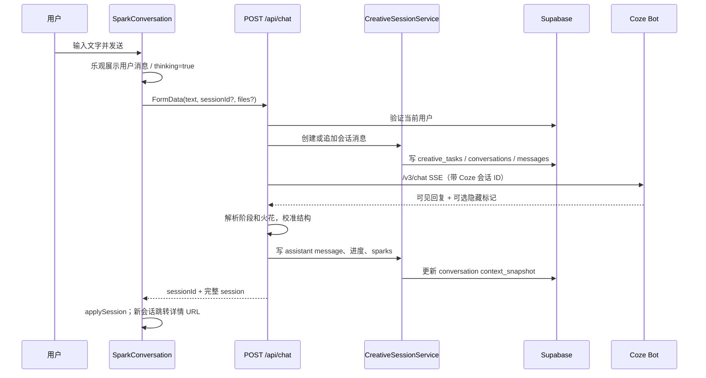
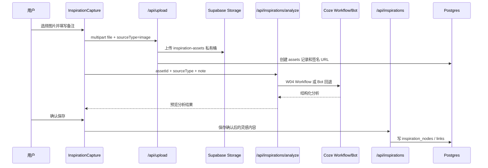

# DesignSpark V1 技术实现说明

## 1. 文档范围与版本

| 项目 | 内容 |
| --- | --- |
| 文档名称 | `DesignSpark_V1_Technical_Solution.md` |
| 产品版本 | DesignSpark V1（代码归档时点） |
| 文档状态 | 基于当前仓库代码、Supabase migration 与可读配置整理 |
| 适用对象 | 产品、设计、研发、测试，以及用于 AI 产品经理项目讲述 |
| 事实边界 | 只描述仓库可以验证的实现；Coze 控制台、线上部署状态与真实运行指标另行标注 |

本文不是未来架构方案。文中“已实现”指可在当前仓库代码中定位到的调用或数据结构；“待产品负责人补充”指必须在 Coze 或部署控制台确认的信息；“历史/非主链路”指仍保留在仓库、但不属于 V1 当前主体验的实现。

## 2. 当前技术栈与运行环境

| 层级 | 当前实现 | 代码/配置依据 | 选择原因、限制与风险 |
| --- | --- | --- | --- |
| Web 框架 | Next.js 15.1，App Router | `package.json`、`src/app/` | 页面与 Route Handler 同仓库，适合将鉴权、服务端密钥调用和 UI 一起组织。V1 未见独立后端服务。 |
| 前端 | React 19、TypeScript 5.7 | `package.json`、`tsconfig.json` | 使用组件内 hooks 管理局部交互状态；未引入 Redux/Zustand。 |
| 样式与动效 | Tailwind CSS 3、Framer Motion | `tailwind.config.ts`、`src/app/globals.css`、组件 | 支撑对话和星系地图的交互展示；复杂视觉组件的维护成本较高。 |
| 数据与认证 | Supabase Auth、Postgres、Storage、RLS | `src/lib/supabase/*`、`supabase/migrations/*` | 用户隔离、会话和私有素材存储在同一服务中；线上项目、迁移是否已全部执行需部署侧确认。 |
| AI 服务 | Coze Bot SSE；可选 Coze Workflow | `src/lib/coze/client.ts` | 主对话直接调用 Bot；图片分析与灵感提炼可使用环境变量指定 Workflow，具体控制台配置不可从仓库确认。 |
| 校验与渲染 | Zod、react-markdown | `src/lib/validators/*`、`SparkConversation.tsx` | API 输入及 AI 结构化输出部分使用 Zod，Agent 可见文本以 Markdown 渲染。 |
| 运行限制 | Node.js Route Handler；聊天 API 最长 180 秒 | `src/app/api/chat/route.ts` | Coze 客户端内部超时为 150 秒，给路由预留返回时间；长响应仍有平台超时风险。 |

本地脚本见 `package.json`：`npm run dev` 使用 3001 端口，`npm run build` 进行生产构建，`npm run typecheck` 执行 TypeScript 检查。

## 3. 系统总体架构图



### 架构说明

1. UI 层只持有当前页面需要的交互状态，并以 `fetch` 调用同域 Route Handler。
2. Route Handler 在服务端通过 Supabase session 获取用户，再调用 service/repository；不会向浏览器暴露 Coze Token。
3. `/api/chat` 是 V1 创意火花主链路：持久化用户消息和附件，调用 Coze，解析隐藏结构化标记，再将对话、进度和火花写回数据库。
4. 灵感捕捉是一条独立链路：文件先进入私有 Storage，分析结果经用户确认后才保存为灵感节点。

## 4. 项目目录和模块职责

| 目录/文件 | 职责 | 当前定位 |
| --- | --- | --- |
| `src/app/` | App Router 页面和 API Route Handler | 当前 UI 与服务端入口 |
| `src/components/spark/` | Sparkie 对话、输入、进度、火花列表/详情 | 创意火花主界面 |
| `src/components/inspiration/` | 星系地图、详情、灵感捕捉 | 灵感沉淀与展示 |
| `src/lib/services/` | 会话、灵感、文件、设置等业务编排 | 主服务层 |
| `src/lib/repositories/` | Supabase 表读写封装 | 数据访问层 |
| `src/lib/coze/client.ts` | Coze SSE、文件上传、Workflow 调用 | 外部 AI 客户端 |
| `src/lib/spark-data.ts`、`spark-progress.ts` | 隐藏标记解析、火花合并、五阶段进度校准 | Agent 输出适配层 |
| `src/lib/creative-galaxy-adapter.ts` | 将会话火花和灵感节点转为星系图数据 | 当前地图数据转换器 |
| `src/types/` | 会话、灵感、图谱等前后端共享类型 | 契约层 |
| `src/lib/validators/` | Zod 输入校验 | 边界校验 |
| `supabase/migrations/` | 表、索引、RLS、Storage 与数据库演进 | 数据库事实来源 |
| `docs/knowledge-base/` | 设计方法知识库源 Markdown | 待上传/绑定 Coze 的知识资产 |
| `src/agents/`、`src/app/api/agent/*` | 本地 Agent/Mock 接口 | 历史或占位，非 V1 `/api/chat` 主链路 |

## 5. 页面、路由和核心组件

### 5.1 当前主要页面

| 路由 | 页面入口 | 关键组件/数据 | 状态 |
| --- | --- | --- | --- |
| `/` | `src/app/page.tsx` | 产品首页 | 已实现 |
| `/login`、`/register` | 对应 `page.tsx` | 表单提交至 Auth Route | 已实现 |
| `/start` | `src/app/start/page.tsx` | 已登录后的起始页 | 已实现 |
| `/spark` | `src/app/spark/page.tsx` | `SparkConversation`，可从灵感节点带入上下文 | 已实现 |
| `/spark/session/[sessionId]` | 会话详情页 | 恢复会话、消息、进度、火花 | 已实现 |
| `/spark/session/[sessionId]/sparks` | 火花列表页 | 已保存的会话火花 | 已实现 |
| `/inspiration-map` | `src/app/inspiration-map/page.tsx` | `CreativeGalaxyMap`、`buildCreativeGraphData` | 已实现 |
| `/settings` | `src/app/settings/page.tsx` | `SettingsForm` 与设置 API | 已实现 |
| `/spark/directions`、`/spark/card` | 旧方向/启动卡页 | `Direction*`、旧表及 mock 回退 | 历史/部分实现，不作为 V1 主链路 |

`middleware.ts` 保护 `/start`、`/spark`、`/inspiration-map`、`/settings` 及子路径。核心服务端页面还会调用 `requireUser()`，API Route 再通过 `supabase.auth.getUser()` 进行鉴权。

### 5.2 核心组件职责

| 组件 | 文件 | 责任 |
| --- | --- | --- |
| `SparkConversation` | `src/components/spark/SparkConversation.tsx` | 会话 UI、乐观显示、请求 `/api/chat`、错误反馈、路由跳转、消息滚动。 |
| `SparkComposer` | `src/components/spark/SparkComposer.tsx` | 文本与附件输入。附件以 FormData 交由聊天 API。 |
| `SparkJourney` | `src/components/spark/SparkJourney.tsx` | 按 `SparkProgress` 展示五阶段进度。 |
| `SparkHistoryDrawer` | `src/components/spark/SparkHistoryDrawer.tsx` | 读取和进入历史会话。 |
| `CreativeGalaxyMap` | `src/components/inspiration/CreativeGalaxyMap.tsx` | 当前灵感地图的布局、节点选择、关系高亮、详情和捕捉入口。 |
| `GalaxyDetailPanel` | `src/components/inspiration/GalaxyDetailPanel.tsx` | 展示火花，并以 `seedSparkContext` 发起新探索。 |
| `InspirationCapture` | `src/components/inspiration/InspirationCapture.tsx` | 文本、图片、语音捕捉，串联上传、分析、确认保存。 |
| `InspirationDetailDialog` | `src/components/inspiration/InspirationDetailDialog.tsx` | 查看或删除独立灵感节点，可跳转到创意火花。 |

## 6. 前端状态管理

V1 没有全局状态库。状态以页面 Server Component 的初始数据和 Client Component 的 `useState`/`useRef`/`useEffect` 为主。

| 状态范围 | 实现 | 说明 |
| --- | --- | --- |
| 创意会话 | `SparkConversation` 本地 state | `sessionId`、`messages`、`sparks`、`progress`、`thinking`、`errorMessage`；服务端完整 session 返回后用 `applySession()` 覆盖本地快照。 |
| 发送体验 | `sendMessage()` | 先插入临时用户消息，再提交 FormData；若服务端已持久化 session，则回填 session，即使 Agent 失败也保留用户消息。 |
| 灵感捕捉 | `InspirationCapture` 本地 state/ref | 输入类型、文件、预览 URL、语音转写、`uploading/analyzing/preview/saving` 阶段。 |
| 星系地图 | `CreativeGalaxyMap` 本地 state | 选择的主题/节点、可见性、关系高亮和弹窗状态。 |
| 登录态 | Supabase cookie session | middleware、服务端 Supabase client 与 API 共同读取，而非浏览器自行保存 Token。 |

限制：跨页面不会维护一个内存全局 store；页面跳转后从 Supabase 重新取数。这降低了状态同步复杂度，但会增加读取次数，也使实时协作不在 V1 范围内。

## 7. 服务端/API 层

Route Handler 位于 `src/app/api/*/route.ts`，每个真实业务接口先创建服务端 Supabase client，再取得当前用户。service 负责业务组合，repository 负责表访问。

| 类型 | 当前主接口 | 说明 |
| --- | --- | --- |
| Agent 对话 | `POST /api/chat` | 主 AI 入口，Node runtime，带请求 ID、持久化、Coze 调用、协议解析。 |
| 会话 | `/api/spark-sessions`、`/api/spark-sessions/[sessionId]` | 会话列表、创建、读取、改标题/归档、删除；另有消息追加与返回提示接口。 |
| 灵感 | `/api/upload`、`/api/inspirations/analyze`、`/api/inspirations` | 私有文件上传、分析、保存、查询、删除、归档读取。 |
| 用户 | `/api/auth/*`、`/api/settings/*` | 登录、注册、退出、设置、头像、密码、账户删除。 |
| 历史接口 | `/api/agent/*`、`/api/flow/*`、`/api/tasks`、单数 `/api/inspiration`、`/api/profile` | 仍在仓库中，但有 mock/占位行为；不应作为 V1 主链路对外承诺。 |

## 8. Coze Agent 接入方式

### 8.1 已实现的 Bot 调用

`chatWithSparkie()`（`src/lib/coze/client.ts`）使用服务端环境变量创建请求：

1. 使用 `COZE_API_TOKEN`、`COZE_BOT_ID` 和可选 `COZE_API_BASE_URL`（默认 `https://api.coze.cn`）。
2. 有图片附件时，后端从 Supabase 短期签名 URL 获取文件并上传至 Coze `/v1/files/upload`。
3. 调用 Coze `/v3/chat`，传入 `bot_id`、`user_id`、`stream: true`、`auto_save_history: true` 和 `additional_messages`。
4. 解析 SSE 事件，汇总回答文本、Coze `conversationId` 与 `chatId`。
5. 150 秒 AbortController 超时；异常分类为未配置、Token 无效、超时、网络、上游错误。

`/api/chat` 会把上轮的 `context_snapshot.coze_conversation_id` 传回 Coze，从而维持同一会话的 Agent 上下文。Coze 的 Conversation ID 与 Chat ID 只保存在服务端数据结构中，不返回 Token。

### 8.2 隐藏输出协议

`buildAgentInput()`（`src/app/api/chat/route.ts`）在可见用户输入后附加 `GALAXY_SPARK_OUTPUT_PROTOCOL`。服务端解析以下标记：

| 标记 | 解析器 | 用途 |
| --- | --- | --- |
| `<SPARK_STATE>` | `parseSparkReply()` | 读取 `currentStage/current_stage`，映射到五阶段进度。 |
| `<SPARK_DATA>` | `parseSparkDataReply()` | 完整火花数据，优先级最高。 |
| `<SPARK_FOUND>` / `<SPARK_FOUND_DATA>` | `parseSparkFoundReply()` | 兼容性的轻量火花；仅在没有有效 `SPARK_DATA` 时使用。 |

普通追问或澄清回复没有有效火花标记时，不会进入个人星系。火花会经过 `ensureGalaxySparkStructure()` 规范化后合并，当前单个会话最多保留 10 颗火花（`src/lib/spark-data.ts`）。

### 8.3 外部配置边界

无法从代码确认以下事项，均为“待产品负责人补充”：Sparkie Bot 的系统提示词、模型、知识库绑定、发布版本、权限、限流、实际 SSE 事件行为，以及生产环境的 Coze 项目/空间配置。

## 9. W01～W05：职责、调用规则与确认边界

W01-W05 在 `docs/knowledge-base/README.md` 中被定义为 Coze 侧工作流语义。仓库代码不能证明五个同名工作流都已在 Coze 控制台部署，因此下表区分代码事实和控制台待确认项。

| 编号 | 目标职责 | 本地可验证的触发/输入/输出 | 当前调用事实 | 异常处理 | 确认状态 |
| --- | --- | --- | --- | --- | --- |
| W01 | 意图识别、任务理解与澄清 | 对话文本、会话上下文；输出由 Bot 可见回复与可选 `SPARK_STATE` 表达 | `/api/chat` 只调用一个 Coze Bot，不按 W01 单独调用 | 无结构化状态时保留可见回复并使用进度校准 | Coze 节点、路由、变量待产品负责人补充 |
| W02 | 三个差异化创意方向 | 理应基于任务、兴趣、限制生成三方向 | 当前主 UI 未见从 Bot 输出解析并写入 `idea_directions` 的实现；旧方向流程使用 mock | 无专用接口降级 | 历史规划/部分实现，非主链路 |
| W03 | 启动卡或完整结构化火花 | `<SPARK_DATA>`，规范化为 title/type/keywords/coreIdea/visualLanguage/developmentDirection/source | `/api/chat` 以 `SPARK_DATA` 为权威火花协议并写入会话快照 | 标记无效时记录告警，保留聊天文本 | 火花持久化已实现；“启动卡”工作流待确认 |
| W04 | 图片设计分析 | 灵感捕捉中的图片 asset、说明文字；输出分析结果 | `analyzeInspiration()` 读取 `COZE_W04_IMAGE_ANALYSIS_WORKFLOW_ID`，有 ID 调 Workflow，无 ID 回退至 Bot | 统一映射为 502/503；前端显示可重试错误 | 接入机制已实现，控制台 Workflow 待补充 |
| W05 | 灵感/偏好候选提炼 | 文本、图片分析结果、语音转写；输出结构化灵感 | `analyzeInspiration()` 读取 `COZE_W05_INSPIRATION_MEMORY_WORKFLOW_ID`，否则 Bot 回退 | Zod/结构化标记校验失败视为分析失败 | 接入机制已实现，控制台 Workflow 待补充 |

**重要差异：** 文档中“W02 三方向”和“W03 启动卡”的产品语义存在，但 V1 主路径目前实际沉淀的是会话火花，并非可验证的三方向/启动卡生成和选择闭环。`idea_directions`、`starter_cards` 表和旧页面存在，不等于该链路已完成。

## 10. 知识库接入

知识资产位于 `docs/knowledge-base/`，包含任务分析、创意方法、视觉语言、设计专项与质量评估等 Markdown。`README.md` 建议建立名为 `DesignSpark_design_knowledge` 的 Coze 文本知识库，并将 W01-W05 与知识主题作语义映射。

**已实现：** 本地知识文件、上传建议和 Coze Bot/Workflow 调用通道。

**无法确认：** 这些文件是否已上传到 Coze、是否关联到 Sparkie Bot/W01-W05、召回参数、命中率、版本策略和线上知识库 ID。上述均需产品负责人从 Coze 控制台补充，不能写成已上线能力。

## 11. 文本调用链路



关键文件：`SparkConversation.tsx#sendMessage`、`src/app/api/chat/route.ts#POST`、`creative-session.service.ts#createCreativeSession`、`appendCreativeSessionAssistantMessage`。

文本为空且无附件返回 400；单条文本超过 20,000 字符返回 400。调用失败时，若用户消息已入库，接口尝试回传当前 session，前端显示错误但保留记录；网络级失败则移除仅存在于前端的乐观消息。

## 12. 图片上传与分析调用链路



`/api/upload` 允许图片和语音两类私有上传，图片大小上限 10MB；保存路径按用户隔离。`/api/inspirations/analyze` 调 `analyzeInspiration()`；图片工作流 ID 未配置时回退 `chatWithSparkie()`，而不是调用浏览器端 AI。分析预览不会自动写入灵感地图，用户点击保存后才走 `POST /api/inspirations`。

在创意对话中上传图片是另一条路径：`/api/chat` 使用 `task-assets` 保存附件，随后只有图片会从签名 URL 转发给 Coze；音频和文档只保存，提示词明确要求 Agent 不得声称已读取其二进制内容。

## 13. 语音保存、转写与提交链路

语音灵感捕捉由 `InspirationCapture.tsx` 实现：

1. 浏览器通过 `MediaRecorder` 录音；同时尝试使用 `SpeechRecognition` 或 `webkitSpeechRecognition` 做浏览器侧实时转写。
2. 若浏览器不支持 SpeechRecognition，组件提示不支持，用户仍可上传音频，但需由服务端分析阶段处理转写。
3. 音频先由 `/api/upload` 存入 `inspiration-assets` 私有桶，允许的 MIME 包括 MP3、M4A、WAV、WebM、OGG 等，上传上限 25MB。
4. `/api/inspirations/analyze` 接收已存在的 `transcript`；若为空，`transcribeVoice()` 通过 Coze Bot 请求 `<TRANSCRIPTION_RESULT>` 结构化文本。
5. 得到转写文本后，W05 Workflow（如果配置）或 Coze Bot 提炼灵感；前端预览、用户确认后才写入 `inspiration_nodes`。

限制和风险：转写依赖浏览器能力或 Coze Bot 的结构化输出，未见独立语音识别供应商与置信度字段；复杂噪声、长音频、方言的效果没有仓库内实测数据。

## 14. 三方向生成链路

**当前结论：部分实现/主链路未接通。**

数据表 `idea_directions`、类型、`DirectionReveal`/`DirectionCarousel` 等旧 UI，以及 `/api/flow/select-direction` 均存在。`src/lib/services/task.service.ts` 中的方向生成来自 `mockDirections`，`/api/agent/generate-directions` 也是占位响应。

因此，不能将“Coze 自动生成三方向并由用户选择”写为 V1 已实现能力。当前可验证的主路线是 Coze 对话输出与 `<SPARK_DATA>` 火花沉淀；若 Coze Bot 的可见文本生成三种建议，它仍是普通文本，不会被当前主链路解析为 `idea_directions` 数据记录。

## 15. 启动卡生成链路

**当前结论：历史数据模型与展示存在，自动生成链路未能在 V1 主路径验证。**

`starter_cards`、`card_versions` 表迁移以及 `StarterCard` 组件、repository、service 均存在，但 `starter-card.service.ts#generateMockStarterCard()` 使用 `mockStarterCard`。旧 `/spark/card` 页面可读取旧表数据，`/api/agent/generate-card` 是占位接口。

PRD 中的启动卡应视为产品演进目标或历史方案；除非补充已发布的 Coze Workflow 与 API 映射证据，否则技术说明不把它标为当前主链路的真实自动生成能力。

## 16. 灵感沉淀和读取链路

### 16.1 独立灵感捕捉

文本、图片或语音的分析结果，经用户确认后调用 `POST /api/inspirations`。`saveInspirationCapture()`（`src/lib/services/inspiration.service.ts`）校验请求、关联 asset，并写入 `inspiration_nodes`；相关标签、视觉标签、摘要、原始内容、转写和分析字段保留在节点及 JSON 扩展字段中。

### 16.2 会话火花进入灵感地图

`/api/chat` 中的 `SPARK_DATA`/`SPARK_FOUND` 被规范化并合并到 `conversations.context_snapshot.session_sparks`。`/inspiration-map` 页面并行读取：

- `listCreativeSessions()` 获取最近会话及其 sparks；
- `getInspirationGraph()` 获取独立保存的 inspiration nodes/links；
- `buildCreativeGraphData()`（`src/lib/creative-galaxy-adapter.ts`）转换为 Theme、Spark、Concept、VisualLanguage 节点与关系。

这种做法让“对话产生的火花”和“用户单独捕捉的灵感”共同被可视化，但它们的持久化位置不同：前者在 conversation JSON 快照，后者在关系型 `inspiration_nodes` 表。

## 17. 核心数据模型与字段

以下字段来自 `supabase/migrations/002_core_tables.sql`、`009_inspiration_capture.sql`、`010_creative_session_history.sql` 和类型定义。只列 V1 主链路高相关数据。

| 模型 | 核心字段 | 用途 |
| --- | --- | --- |
| `profiles` | `id/user_id`、display name、avatar 与偏好相关字段 | 用户资料。 |
| `creative_tasks` | `id`、`user_id`、`title`、`task_type`、`original_input`、`brief_summary`、`status`、`selected_direction_id`、时间戳 | 当前“会话”以创意任务为主体。 |
| `conversations` | `id`、`user_id`、`creative_task_id`、`current_state`、`summary`、`context_snapshot`、`agent_plan` | 保存 Coze conversation ID、火花、进度等会话上下文。 |
| `messages` | `id`、`conversation_id`、`role`、`message_type`、`content`、`intent_detected`、`extracted_data` | 用户与 Sparkie 对话记录；助手记录中包含 Coze chat ID 和进度。 |
| `assets` | `id`、`user_id`、`creative_task_id`、`message_id`、`bucket_id`、`storage_path`、`file_type`、`analysis_result` | 私有文件元数据；二进制在 Storage。 |
| `inspiration_nodes` | `id`、`user_id`、`node_type`、`title`、`content`、`tags`、`visual_tags`、`asset_id`、`starter_card_id` | 用户确认保存的独立灵感。迁移 009 增加 asset 关联和捕捉字段。 |
| `inspiration_links` | `user_id`、`from_node_id`、`to_node_id`、关系字段 | 独立灵感节点的图关系。 |
| `idea_directions` | 方向序号、名称、概念、关键词、风险等 | 旧/规划的三方向数据模型。 |
| `starter_cards`、`card_versions` | 启动卡内容、选择方向、版本快照 | 旧/规划的启动卡模型。 |

### 会话火花结构

`src/types/creative-session.ts` 与 `src/lib/spark-data.ts` 定义会话火花。规范化字段包括：`title`、`type`、`keywords[]`、`coreIdea`、`visualLanguage[]`、`developmentDirection`、`source`，并附带来源 chat、合并次数、生成上下文。它存于 `context_snapshot.session_sparks`，不是一张独立 SQL 表。

## 18. 接口清单和请求/响应结构

### 18.1 V1 主接口

| 方法与路径 | 请求 | 成功响应 | 主要失败 |
| --- | --- | --- | --- |
| `POST /api/chat` | `FormData`: `text`、可选 `sessionId`、`files[]`、`kinds[]`、可选 `seedSparkContext` | `{ sessionId, session }`，新建 201、续聊 200；含 `x-request-id` | 400 空内容/过长，401，502 Coze 上游，503 未配置，504 超时，500 其他错误。 |
| `GET /api/spark-sessions` | cookie session | `{ sessions }` | 401 |
| `POST /api/spark-sessions` | FormData: `mode=blank` 或 `text/files/kinds` | `{ sessionId, session }` | 401、500；创建失败会尝试删除刚创建的会话。 |
| `GET/PATCH/DELETE /api/spark-sessions/[sessionId]` | PATCH `{ title?, archived? }` | session 或 204 | 401、404、400 |
| `POST /api/upload` | FormData: `file`、`sourceType=image|voice` | `{ asset: { id, ... }, fileUrl }` | 400 类型/大小，401，500 |
| `POST /api/inspirations/analyze` | JSON：来源类型、文本/assetId/note/transcript 等 | `InspirationAnalysisResult` | 400 校验，502 Coze，503 配置，500 |
| `GET/POST /api/inspirations` | POST 为确认后的灵感数据 | GET 图数据；POST `{ inspiration }`，201 | 401、400、500 |
| `GET/DELETE /api/inspirations/[inspirationId]` | cookie session | `{ inspiration }` 或 `{ deleted: true }` | 401、404、500 |
| `PATCH /api/settings` | 设置 JSON | `{ profile }` | 400、401、500 |

### 18.2 `/api/chat` 会话响应概念结构

```ts
{
  sessionId: string,
  session: {
    id: string,
    title: string,
    messages: Array<{ id: string; kind: "chat" | "system" | "result"; text: string; attachments?: [] }>,
    progress: { currentStage: string; completedStages: string[]; sourceChatId?: string },
    sparks: Array<{ title: string; keywords: string[]; coreIdea: string; visualLanguage: string[] }>
  }
}
```

这是说明性缩略结构；准确类型以 `src/types/creative-session.ts` 为准。请求或响应不包含 Coze API Token。

## 19. 加载、成功、空状态、失败、超时和重试机制

| 场景 | 当前表现 | 局限 |
| --- | --- | --- |
| 对话加载 | `thinking` 显示 Sparkie 思考态；先乐观渲染用户消息 | 不显示 SSE token 级流式内容，前端等待整轮 session 返回。 |
| 对话成功 | `applySession()` 用服务端完整 session 同步消息、火花、进度 | 单次长调用受 Coze 与平台时间限制。 |
| 对话空状态 | 未开始时显示输入工作区；历史由抽屉读取 | 以当前组件实现为准，未见统一空状态框架。 |
| 对话失败 | 显示服务端 message；已持久化的 session 继续保留 | UI 没有独立“重试同一请求”按钮，用户可重新发送。 |
| Coze 超时 | 客户端 150 秒 abort，API 映射 504 | 无后台队列、断点续跑或自动重试。 |
| 灵感分析 | 阶段文案区分上传、分析、保存和预览；错误按 code 转为用户提示 | 用户需要手动再次点击分析。 |
| 文件失败 | 类型、大小、上传失败返回明确 error code | 无离线队列或分片上传。 |
| 空地图 | `CreativeGalaxyMap` 提供无节点状态和灵感捕捉入口 | 未见服务端预生成推荐。 |

## 20. 登录、鉴权、Token 和环境变量管理

### 20.1 登录与鉴权

- 注册、登录、退出封装在 `src/lib/services/auth.service.ts` 与 `/api/auth/*`。
- `middleware.ts` 使用 Supabase SSR middleware 刷新/校验会话，并拦截受保护路由。
- API Route 不信任客户端传入 userId，统一调用 `supabase.auth.getUser()`。
- 数据库 migration `005_rls.sql` 对业务表启用以用户为边界的 RLS；Storage bucket 的 policy 在 `006_storage.sql` 定义。

### 20.2 环境变量

| 变量 | 用途 | 暴露边界 |
| --- | --- | --- |
| `NEXT_PUBLIC_SUPABASE_URL` | 浏览器/服务端 Supabase 地址 | 可公开配置。 |
| `NEXT_PUBLIC_SUPABASE_ANON_KEY` | 浏览器 Supabase 匿名 key | 可公开，但权限依赖 RLS。 |
| `SUPABASE_SERVICE_ROLE_KEY` | 管理级 Supabase 操作（若使用） | 仅服务端，绝不能放入前端或文档。 |
| `COZE_API_TOKEN` | Coze API 授权 | 仅服务端。 |
| `COZE_BOT_ID` | Sparkie Bot 标识 | 服务器配置，不在 UI 公开。 |
| `COZE_API_BASE_URL` | Coze API 地址覆盖 | 可选。 |
| `COZE_W04_IMAGE_ANALYSIS_WORKFLOW_ID` | 图片分析 Workflow ID | 可选，缺失时 Bot 回退。 |
| `COZE_W05_INSPIRATION_MEMORY_WORKFLOW_ID` | 灵感提炼 Workflow ID | 可选，缺失时 Bot 回退。 |

`.env.example` 只应保留变量名或占位值；真实 `.env.local` 不应提交 GitHub。本文不记录任何真实 Token、URL 或个人资料。

## 21. 性能问题与当前优化

| 已有处理 | 依据 | 作用 |
| --- | --- | --- |
| Coze 请求超时 | `CHAT_TIMEOUT_MS = 150_000`，`/api/chat` `maxDuration = 180` | 防止无限等待。 |
| 私有文件签名 URL | `storage.service.ts` | 避免公开桶和永久公开地址。 |
| 页面按需读取 | Server Component 读取当前页所需会话/图谱 | 简化前端首屏数据来源。 |
| 近端滚动控制与 reduced motion | `SparkConversation`、星系组件 | 减少对话滚动跳动与动效不适。 |
| 会话/表索引 | `supabase/migrations/003_indexes.sql`、010 | 覆盖 user+时间、会话消息、资产等主要查询。 |

当前风险：`/inspiration-map` 会组合最近会话、火花与灵感节点；数据增多后构图和浏览器渲染可能变重。会话附件在发送图片给 Coze 前还需要由服务器下载签名 URL 内容，增加延迟和内存压力。当前没有可确认的缓存、分页、任务队列、性能监控和真实性能指标，不能宣称已达到特定 QPS 或响应时间。

## 22. 测试、联调和回归方案

### 22.1 当前可确认测试资产

- `docs/test-cases.md`：提供设计任务场景的人工测试案例。
- `npm run build`：用于 Next.js 生产构建验证。
- `npm run typecheck`：用于 TypeScript 检查；项目 `tsconfig.json` 包含 `.next/types/**/*.ts`，在未生成完整 `.next` 类型文件的环境中可能先报缺失生成文件，需先运行构建/开发生成。
- 仓库未发现可确认的 Jest、Vitest、Playwright 或 Cypress 自动化测试配置与测试文件。

### 22.2 建议的联调与回归清单

1. Auth：注册、登录、登出、未登录访问受保护页、不同用户的数据隔离。
2. `/api/chat`：新建会话、续聊、文字为空、超长文字、Coze 无 Token、无效 Token、网络失败、超时、合法与非法隐藏标记。
3. 附件：创意对话图片可送 Coze；音频/文档可保存但 Agent 不声称读取；类型和大小限制。
4. 灵感捕捉：文本、图片、语音（支持/不支持 SpeechRecognition）、上传失败、分析预览、确认保存、删除时关联私有文件清理。
5. 地图：无数据、仅会话火花、仅独立灵感、混合数据、节点详情进入新探索。
6. Coze 控制台：分别用真实问题验证 W01-W05 的知识命中、结构化标记、Bot 回退和 Workflow 返回结构。

## 23. GitHub 与 Vercel 部署流程

以下是与当前项目结构匹配的发布流程；是否已完成 GitHub/Vercel 实际绑定，仓库本身无法确认。

1. 本地执行 `npm ci`（或按项目实际包管理器安装）与 `npm run build`，检查不提交 `.env.local`、`.next`、日志和真实密钥。
2. 提交源码、`supabase/migrations`、文档和环境变量示例到目标 GitHub 分支。
3. 在 Vercel 导入该 GitHub 仓库，框架选择 Next.js；构建命令使用 `npm run build`，Vercel 自动运行生产启动配置。
4. 在 Vercel 的 Preview/Production 环境分别配置 Supabase 与 Coze 变量；不要将变量写入 Git 或客户端变量名。
5. 在 Supabase 目标项目按顺序应用 migration，并确认 Auth、RLS、私有 Storage bucket/policy 已生效。
6. 先对 Preview 做冒烟检查，再提升或合并到生产分支。

待产品负责人补充：GitHub 默认分支、Vercel project ID/域名、环境变量是否已配置、Supabase 生产项目与 migration 执行记录、Coze 生产 Bot/Workflow 的发布版本。

## 24. 部署后冒烟检查与回滚

### 冒烟检查

1. 打开首页、注册/登录；确认受保护页未登录时被引导登录。
2. 发送一条纯文本创意输入：确认新 session 创建、Sparkie 回答、刷新后历史仍在。
3. 续聊：确认 Coze conversation 上下文延续、进度/火花不会因刷新丢失。
4. 上传一张图片到创意会话：确认 Storage 资产保存和页面预览；确认 Agent 回复不承诺读取音频/文档。
5. 在灵感地图分别测试文本、图片、语音保存、分析预览、确认、删除与新探索跳转。
6. 检查 Vercel function log 的 `x-request-id`、Coze 错误分类和 Supabase 权限错误；日志中不得出现 Token。

### 回滚原则

- 代码发布异常：在 Vercel 将生产别名切回上一个健康部署，或通过 GitHub 回滚相应提交后重新部署。
- 环境变量错误：修复 Vercel 环境变量后重新部署；不在客户端热修复密钥。
- 数据库迁移：生产 migration 应采用向前兼容的补丁；当前仓库未提供自动数据库回滚脚本，执行前需要备份与人工评审。
- Coze 配置变更：在 Coze 控制台恢复上一个已验证的 Bot/Workflow 发布版本；该能力的具体操作待产品负责人确认。

## 25. 已知问题、技术债和后续优化建议

| 分类 | 事实/风险 | 建议 |
| --- | --- | --- |
| PRD 与主链路差异 | 三方向生成、方向选择、启动卡自动生成在历史页面/表/Mock 中存在，但未接入 `/api/chat` 主路径。 | 先决定是否纳入 V1.1；若纳入，定义 Bot/Workflow JSON 契约、解析器、持久化与回归测试。 |
| W01-W05 可验证性 | 代码仅能验证 Bot/可选 Workflow 的调用入口，不能验证 Coze 控制台真正的工作流编排与知识库绑定。 | 导出或截图固化 Coze 配置、版本号、输入输出示例和回退策略。 |
| 历史文档不一致 | `docs/architecture.md` 的部分表述提到 OpenAI 分析；当前 `inspiration-analysis.service.ts` 实际为 Coze Workflow/Bot。 | 将历史文档标记版本或更新为当前事实，避免面试材料互相矛盾。 |
| 语音能力 | 浏览器实时转写依赖 SpeechRecognition；服务端回退转写依赖 Coze 文本协议，未见置信度与质量评估。 | 增加明确的浏览器兼容提示、转写编辑、失败重试与可观测日志。 |
| 对话流式体验 | Coze 使用 SSE，但 Route Handler 汇总完成后再返回 JSON，前端不显示 token 流。 | 后续可评估将 SSE/ReadableStream 安全地转发给 UI，同时保留最终持久化边界。 |
| 重试与任务韧性 | AI 分析与聊天没有自动重试、队列或幂等请求键。 | 对上传、分析、保存拆分幂等边界，加入用户可见的重试与后台任务状态。 |
| 数据建模 | 会话火花在 JSON 快照，独立灵感在关系表；复杂分析时查询口径需要额外定义。 | 明确“火花是否升级为灵感节点”的产品规则，再决定是否建立独立 sparks 表。 |
| 可观测性 | 有 `console` 和 `x-request-id`，无可确认的指标平台、链路追踪、告警。 | 接入脱敏日志、错误跟踪和关键漏斗事件；先定义事件口径再采集。 |
| 自动化测试 | 当前以手工案例和构建检查为主。 | 为 `/api/chat` 解析、灵感分析 schema、存储权限和关键 UI 流程补单元/集成/E2E 测试。 |

### 面试讲述建议

这个项目的技术重点不是“自己训练模型”，而是将一个外部 Agent 接入设计学习流程：用 Supabase 保存用户可控的数据边界，用 Coze 承担创意引导和结构化输出，用隐藏协议把开放式对话转为可沉淀的火花，用灵感捕捉把文本、图片与语音送入用户确认后的长期资产。对未打通的三方向、启动卡和 Coze 控制台细节，应如实说明为版本取舍和待验证项，而不是扩大为已上线功能。
